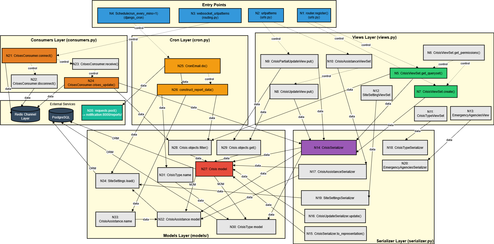
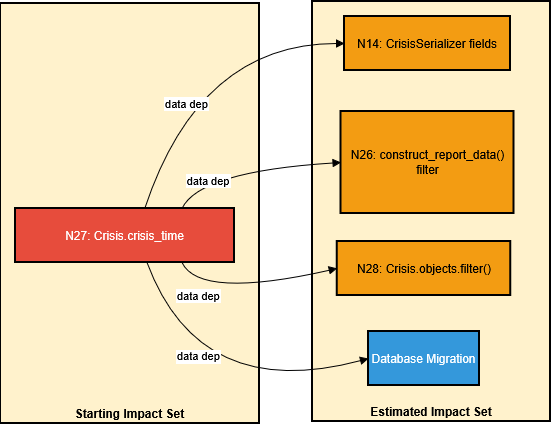

# Program Dependency Graph (PDG) Analysis
## deans-api Django Backend Inter-Component Dependencies

**Course:** WIF3005 - Software Maintenance and Evolution    
**Branch:** assignment2_elvis  
**By:** Elvis Sawing Anak Muran (U2101680)

---

## 1. Introduction

### 1.1 What is a Program Dependency Graph (PDG)?

A **Program Dependency Graph (PDG)** is a directed graph representation that captures dependencies between program elements for impact analysis and program understanding.

| Component | Description |
|-----------|-------------|
| **Nodes** | Functions, methods, or components |
| **Data Dependency** | Solid edge (→) - when one node produces data consumed by another |
| **Control Dependency** | Dashed edge (-->) - when one node's execution controls another's execution |

### 1.2 Scope

This PDG covers **inter-component dependencies** across the deans-api Django backend, combining three major flows:

1. **REST API CRUD Flow** - HTTP request handling
2. **WebSocket Real-time Flow** - Real-time crisis updates
3. **Scheduled Report Flow** - Cron-based email reports

> **Note:** This analysis excludes the `trigger()` signal handler in Crisis.py (lines 166-261) which is covered by a separate Call Graph analysis.

---

## 2. Node Definitions

### 2.1 Node Inventory (35 Nodes)

| Node ID | Location | Function/Component | Type |
|---------|----------|-------------------|------|
| **Entry Points** ||||
| N1 | urls.py | `router.register()` | Config |
| N2 | urls.py | `urlpatterns` | Config |
| N3 | routing.py | `websocket_urlpatterns` | Config |
| N4 | django_cron | `Schedule(run_every_mins=1)` | Config |
| **Views Layer** ||||
| N5 | views.py | `CrisisViewSet.get_queryset()` | Method |
| N6 | views.py | `CrisisViewSet.get_permissions()` | Method |
| N7 | views.py | `CrisisViewSet.create()` | Method |
| N8 | views.py | `CrisisUpdateView.put()` | Method |
| N9 | views.py | `CrisisPartialUpdateView.put()` | Method |
| N10 | views.py | `CrisisAssistanceViewSet` | Class |
| N11 | views.py | `CrisisTypeViewSet` | Class |
| N12 | views.py | `SiteSettingViewSet` | Class |
| N13 | views.py | `EmergencyAgenciesView` | Class |
| **Serializers Layer** ||||
| N14 | serializer.py | `CrisisSerializer` | Class |
| N15 | serializer.py | `CrisisSerializer.to_representation()` | Method |
| N16 | serializer.py | `CrisisUpdateSerializer.update()` | Method |
| N17 | serializer.py | `CrisisAssistanceSerializer` | Class |
| N18 | serializer.py | `CrisisTypeSerializer` | Class |
| N19 | serializer.py | `SiteSettingsSerializer` | Class |
| N20 | serializer.py | `EmergencyAgenciesSerializer` | Class |
| **Consumers Layer** ||||
| N21 | consumers.py | `CrisesConsumer.connect()` | Method |
| N22 | consumers.py | `CrisesConsumer.disconnect()` | Method |
| N23 | consumers.py | `CrisesConsumer.receive()` | Method |
| N24 | consumers.py | `CrisesConsumer.crises_update()` | Method |
| **Cron Layer** ||||
| N25 | cron.py | `CronEmail.do()` | Method |
| N26 | cron.py | `construct_report_data()` | Function |
| **Models Layer** ||||
| N27 | Crisis.py | `Crisis` model | Class |
| N28 | Crisis.py | `Crisis.objects.filter()` | QuerySet |
| N29 | Crisis.py | `Crisis.objects.get()` | QuerySet |
| N30 | CrisisType.py | `CrisisType` model | Class |
| N31 | CrisisType.py | `CrisisType.name` | Field |
| N32 | CrisisAssistance.py | `CrisisAssistance` model | Class |
| N33 | CrisisAssistance.py | `CrisisAssistance.name` | Field |
| N34 | SiteSettings.py | `SiteSettings.load()` | Method |
| **External** ||||
| N35 | external | `requests.post()` to notification | Call |

---

## 3. Inter-Component Program Dependency Graph

### 3.1 Complete PDG Diagram



### 3.2 PDG Edge Legend

| Edge Style | Type | Meaning | Example |
|------------|------|---------|---------|
| **Solid Arrow** (→) | Data Dependency | Data flows from source to target | N5 → N14: ViewSet passes queryset to Serializer |
| **Dashed Arrow** (-->) | Control Dependency | Source controls execution of target | N4 --> N25: Scheduler triggers CronEmail.do() |
| **M2M** | Many-to-Many | Django ORM relationship | N27 → N30: Crisis has M2M to CrisisType |
| **ORM** | Database | Django ORM query | N27 → DB: Crisis model queries PostgreSQL |

---

## 4. Dependency Edge Classification

### 4.1 Control Dependencies (Dashed Edges)

| From | To | Description |
|------|-----|-------------|
| N1 | N5, N7 | Router controls which ViewSet method executes |
| N2 | N8, N9 | URL patterns control update view execution |
| N3 | N21 | WebSocket URL controls consumer instantiation |
| N4 | N25 | Cron schedule controls job execution |
| N6 | N5, N7 | Permission check controls method execution |
| N21 | N22, N23 | Connect controls lifecycle methods |
| N23 | N24 | Receive controls update broadcast |
| N25 | N26 | do() controls construct_report_data() call |

**Total Control Dependencies: 14 edges**

### 4.2 Data Dependencies (Solid Edges)

| Category | From | To | Data Transferred |
|----------|------|-----|------------------|
| **Views→Serializer** | N5,N7,N8,N9 | N14 | Crisis queryset/instance |
| **Views→Serializer** | N10 | N17 | CrisisAssistance queryset |
| **Views→Serializer** | N11 | N18 | CrisisType queryset |
| **Views→Serializer** | N12 | N19 | SiteSettings instance |
| **Views→Serializer** | N13 | N20 | EmergencyAgencies queryset |
| **Views→Models** | N5 | N28 | Filter parameters |
| **Views→Models** | N7 | N27 | Create data |
| **Views→Models** | N8,N9 | N29 | Primary key lookup |
| **Serializer→Models** | N14 | N27,N30,N32 | Model field access |
| **Serializer→Models** | N15,N16 | N27 | Instance data |
| **Consumer→Redis** | N21,N22,N24 | REDIS | Channel group operations |
| **Consumer→Serializer** | N24 | N14 | Serialize for broadcast |
| **Cron→Models** | N26 | N28 | Crisis filter query |
| **Cron→Models** | N26 | N31,N33 | M2M field traversal |
| **Cron→Models** | N26 | N34 | Load site settings |
| **Cron→External** | N25 | N35 | HTTP POST payload |
| **Model→Model** | N27 | N30,N32 | M2M relationship |
| **Model→DB** | N27,N30,N32 | DB | ORM queries |

**Total Data Dependencies: 35+ edges**

---

## 5. Flow Analysis

### 5.1 Flow 1: REST API CRUD

```
HTTP Request → N1/N2 (urls) --control--> N5/N7/N8/N9 (views) 
                                              |
                                              | data
                                              ↓
                                         N14 (serializer)
                                              |
                                              | data
                                              ↓
                                    N27/N28/N29 (models) → DB
```

### 5.2 Flow 2: WebSocket Real-time

```
WS Connect → N3 (routing) --control--> N21 (connect)
                                          |
                                          | data
                                          ↓
                                       REDIS (group_add)
                                          
WS Message → N23 (receive) --control--> N24 (crises_update)
                                              |
                                              | data
                                              ↓
                                    N14 (serialize) → N28 (query) → REDIS (broadcast)
```

### 5.3 Flow 3: Scheduled Report

```
Scheduler → N4 --control--> N25 (CronEmail.do)
                               |
                               | control
                               ↓
                          N26 (construct_report_data)
                               |
                               | data
                               ↓
                    N28 (Crisis.filter) → N31/N33 (M2M names)
                               |
                               | data
                               ↓
                    N35 (requests.post) → notification service
```

---

## 6. Dependency Metrics

### 6.1 Node Centrality Analysis

| Node | Fan-In | Fan-Out | Centrality | Risk Level |
|------|--------|---------|------------|------------|
| **N27 (Crisis)** | 8 | 4 | High | 🔴 Critical |
| **N14 (CrisisSerializer)** | 5 | 3 | High | 🔴 Critical |
| **N28 (Crisis.filter)** | 4 | 1 | Medium | 🟡 Medium |
| **N26 (construct_report_data)** | 1 | 5 | Medium | 🟡 Medium |
| **N5 (get_queryset)** | 1 | 2 | Low | 🟢 Low |

### 6.2 Component Coupling

| Component | Afferent (In) | Efferent (Out) | Instability |
|-----------|---------------|----------------|-------------|
| **models/** | 12 | 3 | 0.20 (Stable) |
| **serializer.py** | 6 | 5 | 0.45 (Moderate) |
| **views.py** | 2 | 8 | 0.80 (Unstable) |
| **consumers.py** | 1 | 4 | 0.80 (Unstable) |
| **cron.py** | 1 | 5 | 0.83 (Unstable) |

> **Instability** = Efferent / (Afferent + Efferent)  
> Lower = more stable (changes have high ripple effect)

---

## 7. Impact Analysis

### 7.1 High-Impact Nodes

| Node | Impact Scope | Affected Nodes |
|------|--------------|----------------|
| **N27 (Crisis model)** | System-wide | N5, N7, N8, N9, N14, N15, N16, N24, N26, N28, N29 |
| **N14 (CrisisSerializer)** | API + WebSocket | N5, N7, N8, N9, N24 |
| **N30 (CrisisType)** | Data display | N14, N26 (via N31) |
| **N32 (CrisisAssistance)** | Data display | N14, N26 (via N33) |

### 7.2 Change Propagation Example

**Scenario:** Rename `Crisis.crisis_time` to `Crisis.reported_time`



### 7.3 Ripple Effect Matrix

| Changed Node | Direct Impact | Indirect Impact | Total |
|--------------|---------------|-----------------|-------|
| N27 (Crisis) | N14, N26, N28, N29 | N5, N7, N8, N9, N24, N25 | 10 |
| N30 (CrisisType) | N14, N26 | N5, N7, N24, N25 | 6 |
| N14 (Serializer) | N5, N7, N8, N9, N24 | - | 5 |
| N26 (construct_report) | N25 | N35 | 2 |

---

## 8. Summary

### 8.1 PDG Statistics

| Metric | Count |
|--------|-------|
| **Total Nodes** | 35 |
| **Control Dependencies** | 14 |
| **Data Dependencies** | 35+ |
| **External Integrations** | 3 (Redis, PostgreSQL, Notification Service) |

### 8.2 Key Findings

1. **Crisis model (N27)** is the most critical node with highest fan-in (8 incoming data dependencies)
2. **CrisisSerializer (N14)** acts as the central data transformation hub for all API and WebSocket operations
3. **models/ layer** is the most stable component (Instability = 0.20)
4. **views.py and cron.py** are unstable components that depend on stable layers
5. **Three distinct execution flows** share common data dependencies through models/

### 8.3 Recommendations

| Priority | Recommendation | Affected Nodes |
|----------|----------------|----------------|
| High | Add comprehensive tests for Crisis model changes | N27, N28, N29 |
| High | Create interface for CrisisSerializer to reduce coupling | N14 |
| Medium | Abstract notification service call behind interface | N35 |
| Low | Consider caching for frequently accessed CrisisType/Assistance | N30, N31, N32, N33 |

---

## 9. Appendix: Node Reference

### 9.1 Source Code Mapping

| Node | File | Line Numbers | Function Signature |
|------|------|--------------|-------------------|
| N5 | views.py | 42-45 | `CrisisViewSet.get_queryset(self)` |
| N7 | views.py | 42 | `CrisisViewSet` (inherits create) |
| N14 | serializer.py | 27-46 | `class CrisisSerializer` |
| N21 | consumers.py | 11-21 | `CrisesConsumer.connect(self)` |
| N25 | cron.py | 77-89 | `CronEmail.do(self)` |
| N26 | cron.py | 13-70 | `construct_report_data()` |
| N27 | Crisis.py | 38-57 | `class Crisis(models.Model)` |

---